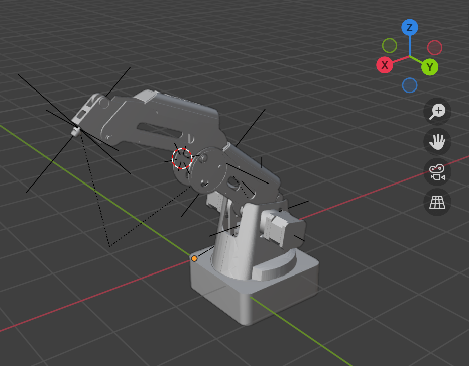

# Dobot Magician机械臂

## 一、3D建模

### **软件版本**

​	Blender 4.5及以上

### **内容介绍**

​	建模工具采用Blender，这是一个开源免费的3D动画建模软件。

​	下载安装Blender后直接打开`.blend`文件即可查看。

​	另外笔者预设了一段动画，直接点击下方轨道可以从0s开始播放

## 二、Unity项目

### **软件版本**

​	Unity任一版本即可

> 笔者只导出了Unity项目中Assert部分的内容，这代表该项目对其它的library和package无依赖性，你可以选择任一Unity版本创建新项目，将该仓库中Assert/中的内容复制进去即可。

### **内容介绍**

​	笔者将上述Blender项目导出为.fbx文件，再导入Unity项目，并写了一个简单的旋转脚本供使用。你可以在此基础上进行扩展，比如在`Update()`中实时更新关节角度，等等。

​	值得注意的是，要想和实体机械臂进行拟合，4个旋转轴的Transform的初值(尤其是rotation)需要你手动设置一下，在此不赘述。

> 在运行之前请别忘了在脚本配置界面配置4个旋转轴。
> 详见images/旋转轴配置

